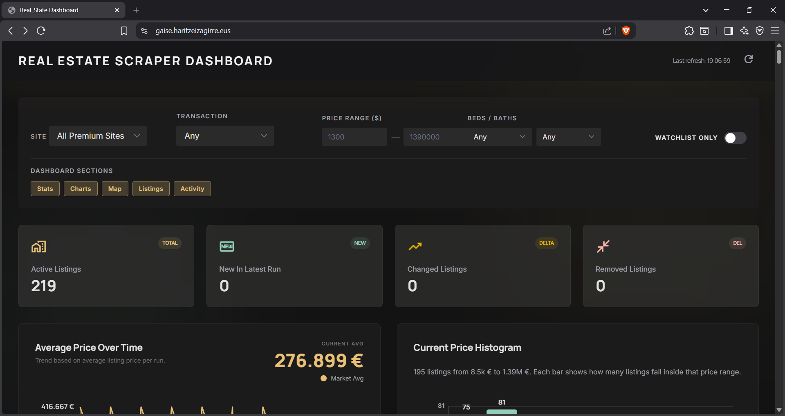
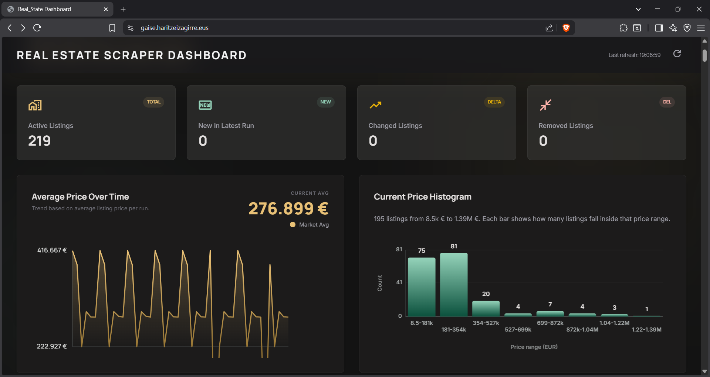
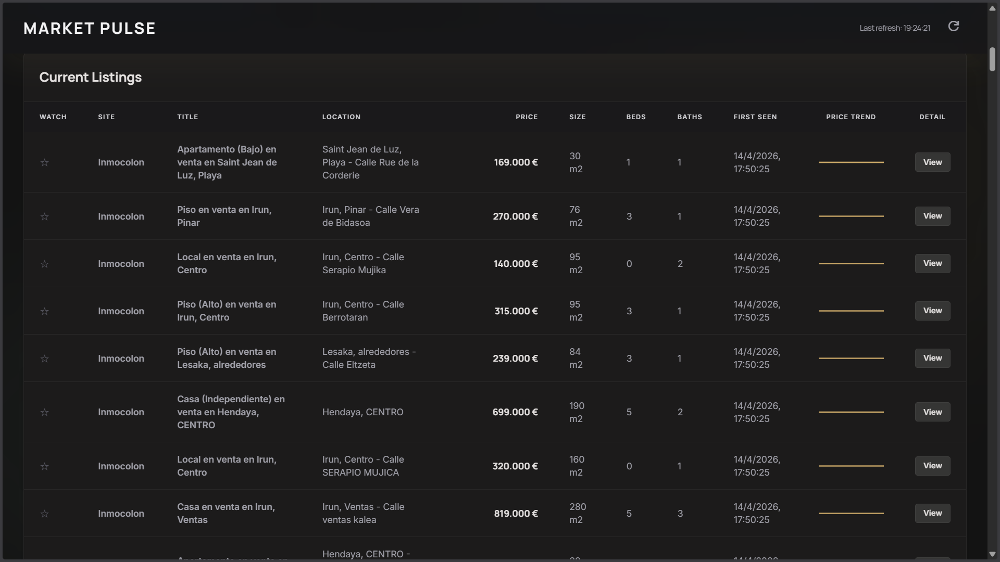
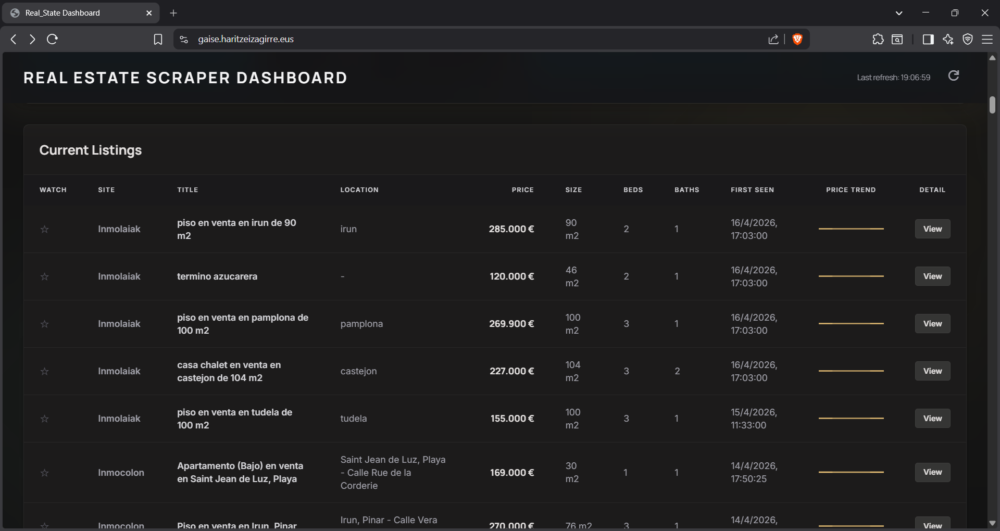
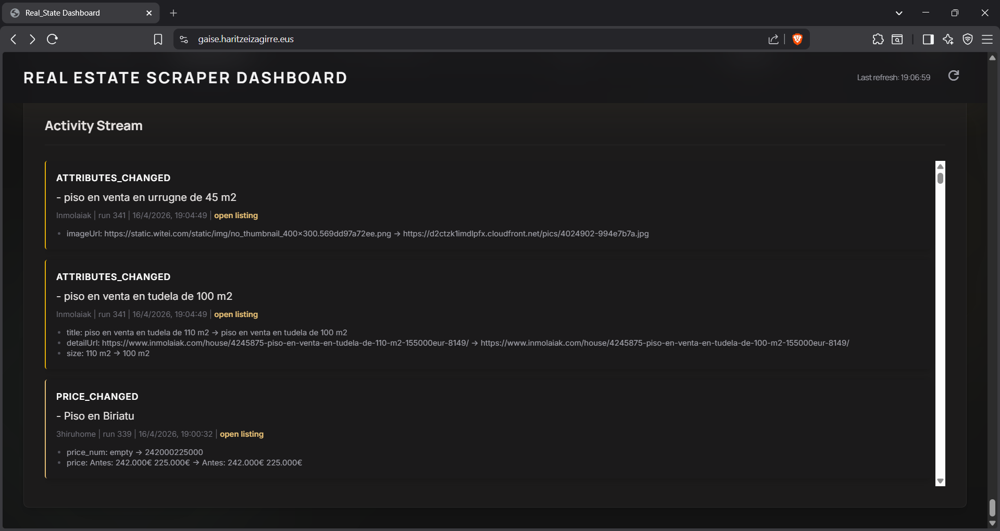
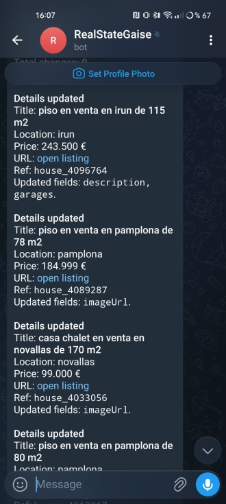
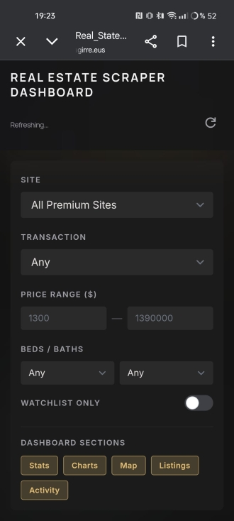
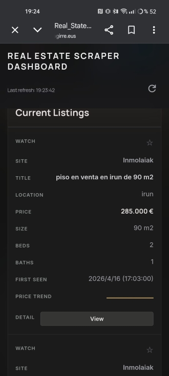

# Real Estate Scraping Project 

- Student: Haritz Eizagirre
- Domain: [gaise.haritzeizagirre.eus](https://gaise.haritzeizagirre.eus)


## What I built:

- A multi-site real-estate monitoring pipeline with an adapter architecture.
- Automated scraping with Playwright for multiple agencies.
- Cloud persistence in Turso (online SQLite).
- Change detection (new, price changed, attributes changed, removed, reappeared).
- Telegram notifications when relevant changes are detected.
- A read-only dashboard web app with filters, stats, charts, change feed and map.
- Production deployment with HTTPS and automated background execution.


## Milestones Completed

| Milestone | Status | What was implemented |
|---|---|---|
| Milestone 0 (Exercises 1-6 preparation) | Completed | Playwright-based scraping groundwork and initial extraction workflow. |
| Milestone 1 | Completed | Adapter architecture with siteId + list(params), CLI scraping command, stable listing IDs. |
| Milestone 2 | Completed | Persistence layer in Turso with upsert behavior and status command. |
| Milestone 3 | Completed | Full monitoring model with scrape_runs, listings_current, listings_snapshot, listing_changes and structured diffs. |
| Milestone 4 (optional) | Completed | Telegram notifications with HTML-safe message building and dry-run handling. |
| Milestone 5 | Completed | Scheduler mode (--schedule), one-shot mode (--once), and optional /health endpoint. |
| Milestone 6 | Completed | Dashboard server + SPA with current listings, change log, summary metrics, filters, charts and map. |
| Milestone 7 | Completed | Create an Ubuntu 24.04 virtual machine running in AWS*, accessible via SSH |
| Milestone 8 | Completed | My real-estate monitor codebase cloned on the server, all the dependencies installed and a non-root user (deploy) created.  |
| Milestone 9 | Completed | My haritzeizagirre.eus domain pointing to my AWS VM IP address using Dinahosting as the hosting of our domain. |
| Milestone 10 | Completed | Made my dashboard publicly accessible at gaise.haritzeizagirre.eus and the scraper running automatically each 30 minutes.|

*Even though the deployment lab describes Azure, I deployed successfully on AWS VM with equivalent production components (Nginx, HTTPS, system service, scheduled scraping) due to Azure's lack of B1s machines.


## Adapter Implementations 

The project uses one adapter per website, all following the same contract:

- siteId: unique adapter identifier
- list(params): async function returning listings with stable, non-empty id

Implemented adapters:

| Adapter siteId | Website | Implementation notes |
|---|---|---|
| iparralde | https://inmobiliariaiparralde.com/ | Primary target site; paginated scraping + detail enrichment for extra fields. |
| mascasa | https://mascasainmobiliaria.com/ | Property card scraping + detail page enrichment (reference, features, media). |
| inmolaiak | https://www.inmolaiak.com/ | Search/listing extraction with URL-derived fallback data + detail enrichment. |
| inmocolon | https://www.inmocolon.com/ | Search URL strategy for sale/rent, plus homepage featured-listing support. |
| urme | https://www.urme.es/ | Separate feeds for sale/rent, normalized feature extraction and re-usable parsing helpers. |
| 3hiruhome | https://www.3hiruhome.com/ | Category discovery (sale/rent), pagination, and optional detail enrichment. |

Common adapter behavior:

- Stable ID derivation from canonical listing URL (with hash fallback).
- Data normalization for text and numeric fields.
- Detail-page enrichment to complete reference, description, transaction type, size, bedrooms, bathrooms, garages, and image URL.
- Deduplication by listing id before storing results.

## Dashboard and Feature Screenshots

### Dashboard (live domain)







### Telegram Bot Alerts 





## Problems Encountered

- Azure VM provisioning issue (region constraints), so deployment was moved to AWS.
- AI tooling (Qwen Code) instability on VM during setup, requiring manual completion of deployment steps.
- Real-estate sites have inconsistent HTML structures, so adapters needed robust fallback selectors and normalization logic.
- Turso access issue: some scraped price values were malformed and generated `price_num` integers larger than JavaScript's safe numeric range. This caused Turso to fail with: "Received integer which is too large to be safely represented as a JavaScript number". I fixed it by cleaning the corrupted rows in Turso and hardening the normalization logic to reject unrealistic values and parse only valid price tokens.


## Additional Comments

- It was so difficult to make an adapter to scrap all the info correctly on some websites especially in data such as the number of bedrooms or bathrooms due to the inconsistency of the data in those websites.
- I improved the dashboard website's UI using Stitch MCP on Antigravity and also 
making it responsive so that it can be used on devices such as mobile phones.




## Deployment Architecture

Production setup:

- Cloud VM (Ubuntu 24.04 LTS)
- Node.js backend processes (scraper + dashboard)
- Nginx reverse proxy (HTTP/HTTPS)
- Certbot for TLS certificates and renewal
- Turso for cloud SQL persistence
- systemd and/or cron for automated execution

## Quick Commands

```bash
# Scrape one site and print JSON
node scrape.js --site iparralde

# Scrape and persist changes
node scrape.js --site iparralde --persist

# Run all sites once
node scrape.js --once

# Start periodic scheduler
node scrape.js --schedule "0 * * * *"

# Start dashboard
node dashboard.js --port 3000
```
